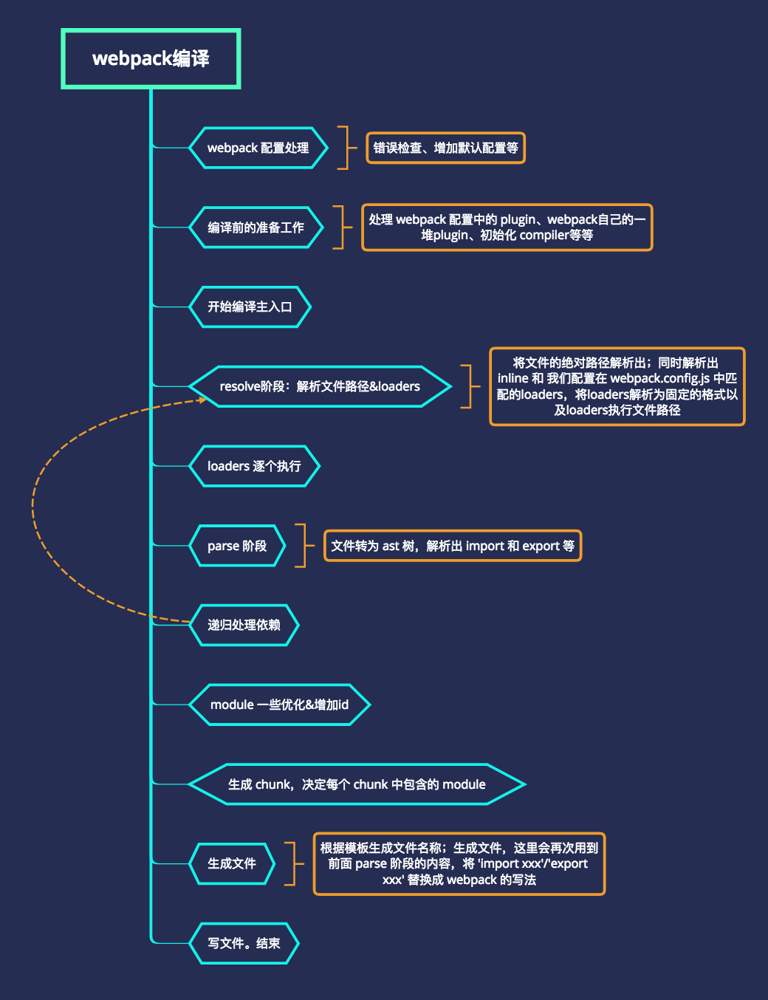

# webpack 4

node v10

Webpack 4 + React 16.x 配置 demo, 尝试使用 v16 的新特性

- 入口文件 `/src/index.js'`
- 输出文件夹 `/dist`
- 模板文件 `/src/index.html'`

## DLL 打包

如果 src 目录没有 dll，需要先执行 `npm run dll`，一般只用运行一次，除非依赖的库版本有变化

## 开发

`npm run dev`

## 部署

`npm run build`

## 分析

`npm run analyze`

## Tree Shaking

项目 package.json 配置 `"sideEffects": false` 告诉 webpack 可以安全的 Shaking 没有副作用的代码，删除没有使用到的 exports 代码

> 副作用定义: 在 import 时候执行的代码具有副作用

使用数组排除副作用代码

```js
"sideEffects": [
    "./src/some-side-effectful-file.js",
    "*.css"
  ]
```

dll 插件

```js
new webpack.DllReferencePlugin({
  context: __dirname,
  manifest: require('./src/assets/dll/react-manifest.json'),
}),
```

index.html 引入 *.dll.js

```js
const autoAddDllRes = () => {
  const AddAssetHtmlPlugin = require('add-asset-html-webpack-plugin');
  return new AddAssetHtmlPlugin([{ // 往html中注入dll js
      publicPath: './dll/', // 注入到html文件中 src 的路径
      outputPath: './dll/', // dll.js 文件输出的目录
      filepath: './src/dll/*.js', // dll.js 来源目录
      includeSourcemap: false,
      typeOfAsset: 'js' // options js、css; default js
  }]);
};
// 添加插件
autoAddDllRes()
```


## 全局注册
```js
// 全局注册, 不需要 import
new webpack.ProvidePlugin({
  axios: 'axios',
  React: 'react'
})
```

## Webpack 打包流程图



[图片来源](https://juejin.im/post/5c6b78cdf265da2da15db125)

## 解决打包全部引入 Icon

参考

[知乎 登来的回答](https://www.zhihu.com/question/308898834/answer/573515745)

1. 安装Antd的图标库。Antd已经将@ant-design/icons 作为依赖包安装过，我们只需将他添加到package.json中，这样规范一点。 npm install --save @ant-design/icons
2. 创建文件utils/antdIcon.js，导出你要使用的图标

## hoist-non-react-statics 报错

提示 `node_modules/@types/hoist-non-react-statics/index"' has no default export`

打开 `./node_modules/antd/lib/form/interface.d.ts:2:8 `


将 `import hoistNonReactStatics from 'hoist-non-react-statics';`

修改为 `import * as hoistNonReactStatics from 'hoist-non-react-statics';`

## TODO

- [ ] React.lazy 无效
- [ ] 按需加载 antd 无效
- [ ] 优化 antd webpack后被迫引进全部 icons
- [ ] 生产环境 webpack 配置 alias 引入 antd Icons 不生效